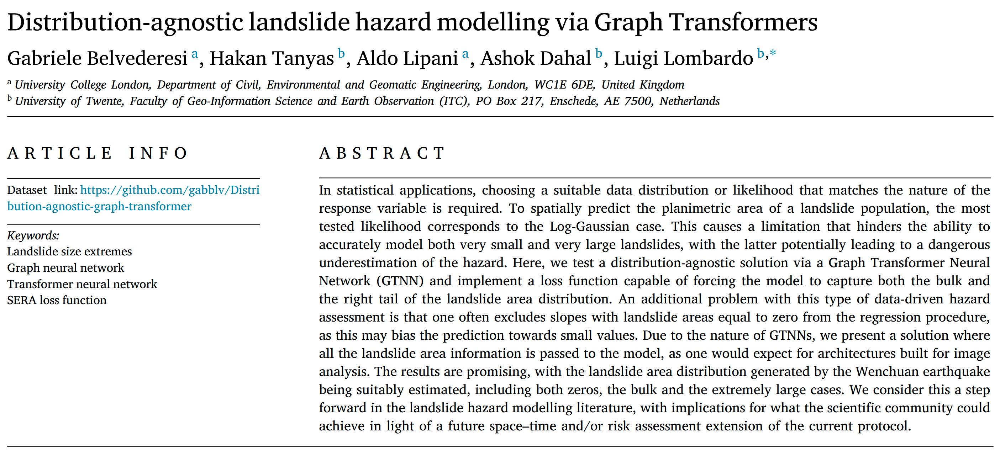

**Summary**: 

Distribution-agnostic graph transformer architecture.

The project aimed at predicting landslide extents on a highly right-skewed dataset.

It uses a non-standard loss function, the Squared Error Relevance Area (SERA), and the Mean Squared Error (MSE) as performance metric.

--------------------------------------------------

[Research article available here](https://doi.org/10.1016/j.envsoft.2024.106231)

--------------------------------------------------

**Reproducibility**:

Within the environment created from `pythonenv/environment.yaml`, run `run.py`. This will execute the model tenfold, once for each of the ten deciles used as test set.\
\
Alternatively, it is possible to run the model for one single test set by specifying the desired test set decile in `configs/SU_params.json` (`"dataset":"pickle"`) and running `main.py`.

(*Optional*) Run `pred_visualization.ipynb` to visualize the predictions.\
Before running, please extract the *gpkg* contained in`data/custom/Wenchuan_data_final.zip` into `data/custom/`.

--------------------------------------------------

**Note**:

`data_prep.ipynb` is provided as reference to share the preparation of the original *gpkg* dataset as the model input.

