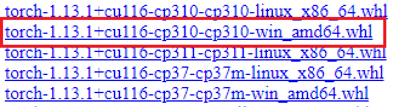

**Summary**: 

Distribution-agnostic graph transformer architecture.

Specifically, the project aimed at predicting landslide extents (regression) on a highly right-skewed dataset.

It uses a non-standard loss function, the Squared Error Relevance Area (SERA), and the Mean Squared Error (MSE) as performance metric.

Research article available here:

[Distribution-agnostic landslide hazard modeling via Graph Transformers](https://doi.org/10.1016/j.envsoft.2024.106231)

**Reproducibility**:

1 - Install the python environment from `pythonenv/environment.yml` ($^*$)

($^*$)  The environment uses ` torch==1.13.1+cu116` from the following link:

https://download.pytorch.org/whl/torch/

2 - Run `run.py`

3 - (*Optional*) Run `pred_visualization.ipynb` to visualize the predictions. Before running, please extract the *gpkg* contained in`data/custom/Wenchuan_data_final.zip` into `data/custom/`

**Note**:

`data_prep.ipynb` is also provided as reference, sharing the preparation of the original dataset as model input.
